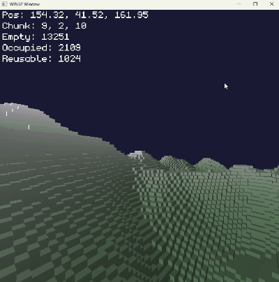

# Handmade Voxel Game

This repository contains the code for a (C-style) C++ 3D voxel game. The project is inspired by Casey Muratori's [Handmade Hero](https://hero.handmade.network/) series, whose goal is to write a complete video game _from scratch_ without relying on any third party dependencies or the C/C++ standard library.

The Windows platform layer uses:
- Win32 API
- GameInput
- Vulkan

All of which should be available on a stock Windows 10+ install with up-to-date drivers.

## Why ?

Because it's fun ! Writing a complete codebase is also a great learning exercise.
Here is a short list of things I have learnt about / implemented from scratch thanks to this project :
- A PNG loader capable of loading and decompressing simple image assets.
- A robin-hood hashmap.
- A buddy allocator for managing VRAM.

## How to build:

Making everything from scratch also implies not relying on tools like CMake to handle the build process. This is thankfully much easier
without dependencies to manage : the build script even generates a `compile_commands.json` file, so you get complete LSP functionality in your favorite
`clangd`-compatible editor !

Running the `build.py` file should just work, provided you have:
- `clang.exe` on your PATH.
- The most recent version of the Windows 11 SDK (>= 10.0.26100), due to the GameInput dependency.
- A Vulkan SDK installation.

You can then run `build/win32_game.exe`.

## Controls:

- WASD: Horizontal movement
- Q/E: Vertical movement
- LEFT SHIFT: Sprint
- SPACE: Remove block
- F11: Toggle fullscreen

## Game code hot-reloading:

While the game is running, you can edit the `game.cpp` file and the code will be instantly hot-reloaded by the main executable when you run the build script.
Since all the memory the game uses is allocated from the OS by the base executable at startup, game state will be preserved across reloads.

## Short-term TO-DO list:

### Engine:
- [x] Game code hot-reloading
- [x] Keyboard & controller input processing (using the Windows 10+ GameInput lib)
- [x] Generating `compile_commands.json` inside the build script
- [ ] Shaders hot-reloading
- [x] Swapchain resizing
- [ ] Sound output (WASAPI ?)
- [ ] Save states (like an emulator)
- [ ] "Topmost" window mode (useful to keep the window on top of the editor while hot-reloading)
- [x] Basic matrix math library
- [ ] Logging

### Game:
- [x] Basic PNG decoder
- [x] Debug text rendering using a bitmap font
- [x] Single-Threaded chunk streaming system
- [x] Procedular heightmap with simplex noise
- [ ] Greedy meshing
- [ ] Asynchronous GPU transfer for the meshes
