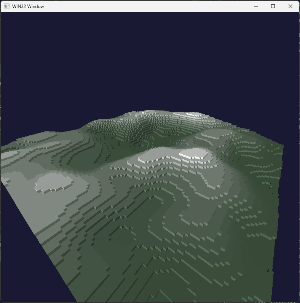

# Handmade Voxel Game

This repository contains the code for a (C-style) C++ 3D voxel game. The project is inspired by Casey Muratori's [Handmade Hero](https://hero.handmade.network/) series, whose goal is to write a complete video game _from scratch_ without relying on any third party dependencies or the C/C++ standard library.

The Windows platform layer uses:
- Win32 API
- GameInput
- D3D12

All of which should be available on a stock Windows 10+ install.

## Why ?

Because it's fun ! Writing a complete codebase is also a great learning exercise.

## How to build:

Making everything from scratch also implies not relying on tools like CMake to handle the build process. This is thankfully much easier
without dependencies to manage : the build script even generates a `compile_commands.json` file, so you get complete LSP functionality in your favorite
`clangd`-compatible editor !
Running the `build.py` file should just work, provided you have `clang.exe` on your PATH. You can then just run `build/win32_game.exe`.

## Controls:

- WASD: Horizontal movement
- Q/E: Vertical movement
- LEFT SHIFT: Sprint
- SPACE: Remove block

## Game code hot-reloading:

While the game is running, you can edit the `game.cpp` file and the code will be instantly hot-reloaded by the main executable when you run the build script.
Since all the memory the game uses is taken from a block allocated at startup, game state will be preserved across reloads.

## Short-term TO-DO list:

### Engine:
- [x] Game code hot-reloading
- [x] Keyboard & controller input processing (using the Windows 10+ GameInput lib)
- [x] Generating `compile_commands.json` inside the build script
- [ ] Shaders hot-reloading
- [ ] Swapchain resizing
- [ ] Sound output (WASAPI ?)
- [ ] Save states (like an emulator)
- [ ] Looped input recording & playback
- [ ] "Topmost" window mode (useful to keep the window on top of the editor while hot-reloading)
- [x] Basic matrix math library
- [ ] High level renderer API
- [ ] Logging
- [ ] UI & (bitmap) text rendering
- [ ] Thread pool ?? For async asset streaming

### Game:
- [ ] Chunk data streaming system
- [ ] Procedular heightmap with perlin noise
- [ ] Greedy meshing
- [ ] Asynchronous GPU transfer for the meshes
